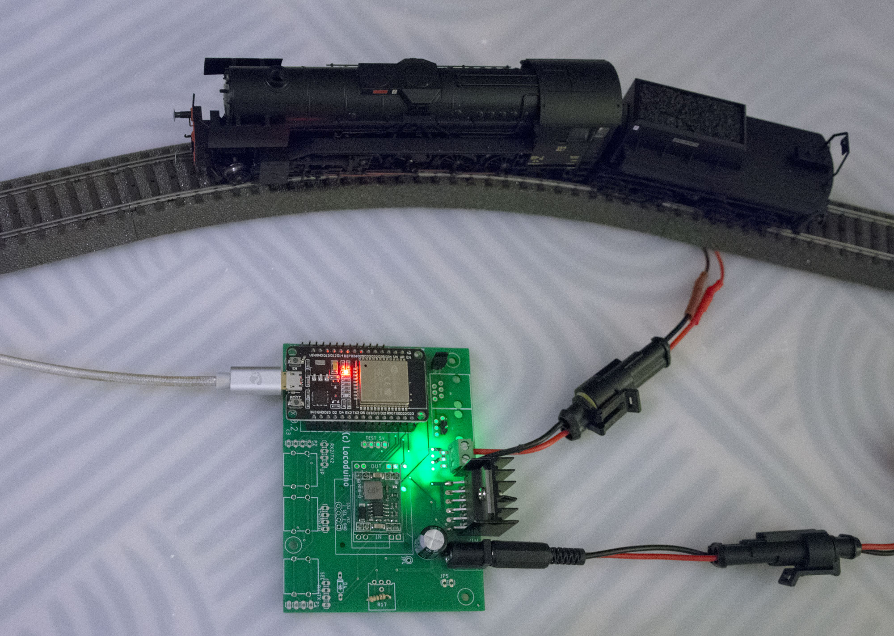

# Centrale MFX

Ce projet propose une centrale numérique **MFX** destinée à piloter des locomotives Märklin au format MFX. Conçue pour fonctionner sur une architecture ESP32, cette solution est une alternative aux propositions commerciales.

##/!\
Il s'agit d'une version qui est en cours de développement mais qui est fonctionnelle. D’ors et déjà, il est possible de commander des locomotives au travers du port série avec des commandes basiques du style ‘m’ pour mise sous tension, ‘8’ ou’9’ pour choisir l’adresse de la locomotive et ‘1’ à ‘9’ pour la vitesse  et ’d’ pour changer la direction avant ou arrière.

Ce sujet fait l'objet d'un fil sur le forum 3R : https://forum.3rails.fr/t/controler-vos-trains-mfx-depuis-un-arduino-due-sans-passer-par-la-gleisbox/27563

### Fonctionnalités principales
- Support complet du protocole **MFX**.
- Gestion de plusieurs locomotives simultanément.
- Transmission des ordres de direction, vitesse et fonctions annexes (ex : éclairage, son).
- Communication en temps réel avec le bus CAN ou d'autres périphériques.
- Interface utilisateur via WiFi et Ethernet.
- Gestion optimisée des ressources grâce à FreeRTOS.

### Matériel requis
- **ESP32** : Microcontrôleur principal.
- **Pont en H** (ex : L293D ou équivalent) pour commander les rails.
- **Source d'alimentation** adaptée à la tension des rails Märklin. (env 18V)

Ce projet propose une centrale numérique **MFX** destinée à piloter des locomotives Märklin au format MFX. Conçue pour fonctionner sur une architecture ESP32, cette solution offre une alternative compacte, performante et personnalisable pour les passionnés de modélisme ferroviaire.

### Fonctionnalités principales

- **Support du protocole MFX**
- **Contrôle simultané de multiples locomotives** : possibilité de gérer plusieurs trains en même temps.
- **Commandes en temps réel** : ajustement de la direction, de la vitesse et des fonctions auxiliaires (éclairage, son, etc.).
- **Interface utilisateur via WiFi et CAN** : Interface vers Rocrail et autres logiciels de gestion de réseau.
- **Gestion optimisée des ressources** : utilisation de FreeRTOS pour une répartition efficace des tâches.

### Matériel requis

- **ESP32** : microcontrôleur principal assurant la gestion des communications et du contrôle.
- **Pont en H** (par exemple, L293D ou équivalent) : pour la commande de la puissance des rails.
- **Alimentation** : adaptée à la tension requise par les rails Märklin. (env 18V)

LaBox de Locoduino convient parfaitement et apporte une base hard complète et épprouvée : https://forum.locoduino.org/index.php?topic=1618.msg20062#msg20062

### Contribution

Les contributions sont les bienvenues ! Si vous souhaitez participer, veuillez ouvrir une **issue** ou soumettre une **pull request**.

### Licence

Ce projet est basé sur un travail qui peut être consulté ici : https://gelit.ch/Train/DirectMFX.ino et https://gelit.ch/Train/MFX.pdf

